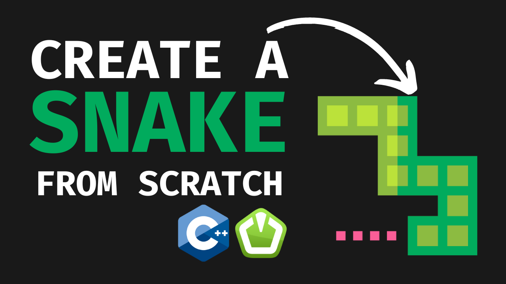

# 🐍 Snake SFML

[](LICENSE)

A classic Snake game implemented using SFML library. This project was coded on twitch. Here is a replay:

[](https://www.youtube.com/watch?v=jyDlxqVOZMAs)

## 🎮 Gameplay

In this game, you control a snake that moves around the screen and eats food to grow longer. The objective is to avoid colliding with the snake's own body. The game ends when the snake collides with any of these obstacles.

## 🚀 Features

- Simple and intuitive controls
- Randomly generated food for the snake to eat
- Score tracking to keep track of your progress

## 🛠️ Installation

1. Clone the repository:

```bash
git clone https://github.com/your-username/sfml-snake.git
```

2. Build the project using Make:

```bash
cd sfml-snake
mkdir bin
mkdir obj
make
```

3. Run the game:

```bash
./bin/sfml-snake
```

## 🕹️ Controls

- Use the arrow keys to control the snake's movement:
  - Up: Move the snake upwards
  - Down: Move the snake downwards
  - Left: Move the snake to the left
  - Right: Move the snake to the right

## 📝 License

This project is licensed under the [MIT License](LICENSE).

## 🤝 Contributing

Contributions are welcome! If you have any ideas, suggestions, or bug reports, please open an issue or submit a pull request.

## 📞 Contact

For any questions or inquiries, feel free to open an issue.
